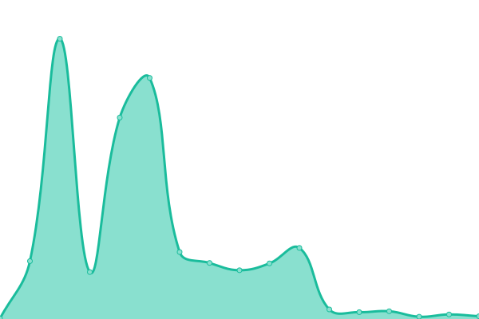
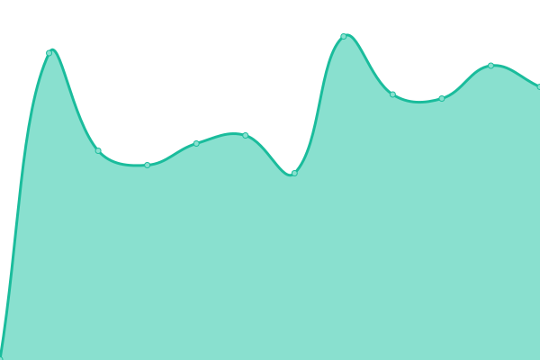
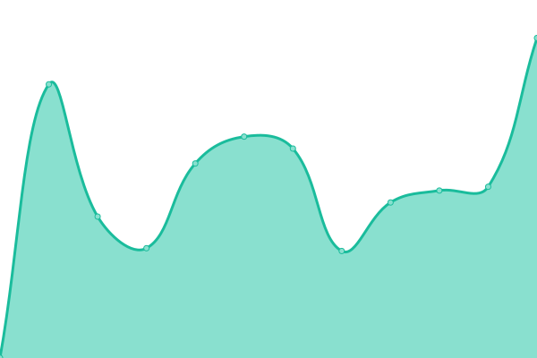
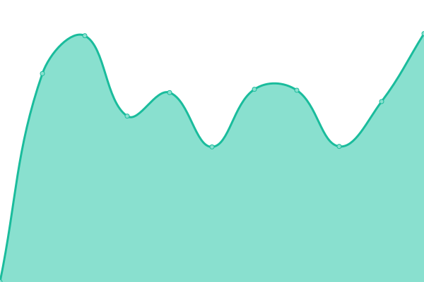
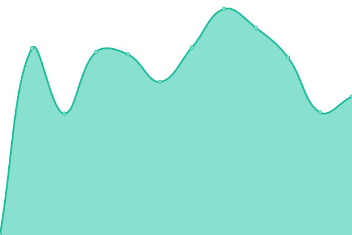
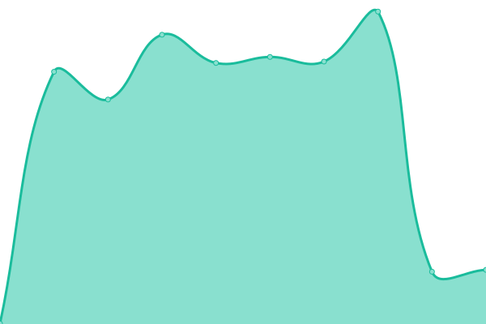

# [📈 Live Status](https://VanIerselDev.github.io/status): <!--live status--> **🟩 All systems operational**

This repository contains the open-source uptime monitor and status page for [VanIerselDev](https://VanIerselDev.github.io/status), powered by [Upptime](https://github.com/upptime/upptime).

With [Upptime](https://upptime.js.org), you can get your own unlimited and free uptime monitor and status page, powered entirely by a GitHub repository. We use [Issues](https://github.com/VanIerselDev/status/issues) as incident reports, [Actions](https://github.com/VanIerselDev/status/actions) as uptime monitors, and [Pages](https://VanIerselDev.github.io/status) for the status page.

<!--start: status pages-->
<!-- This summary is generated by Upptime (https://github.com/upptime/upptime) -->
<!-- Do not edit this manually, your changes will be overwritten -->
<!-- prettier-ignore -->
| URL | Status | History | Response Time | Uptime |
| --- | ------ | ------- | ------------- | ------ |
|  [Salonnare](https://salonnare.com) | 🟩 Up | [salonnare.yml](https://github.com/VanIerselDev/status/commits/HEAD/history/salonnare.yml) | 

 606ms
     
 | 

<a href="https://status.vaniersel.dev/history/salonnare">100.00%</a>
    

|  [API Server](https://salonnare.com/health) | 🟩 Up | [api-server.yml](https://github.com/VanIerselDev/status/commits/HEAD/history/api-server.yml) | 

 1054ms
     
 | 

<a href="https://status.vaniersel.dev/history/api-server">98.13%</a>
    

|  [Help Center](https://help.salonnare.com) | 🟩 Up | [help-center.yml](https://github.com/VanIerselDev/status/commits/HEAD/history/help-center.yml) | 

 524ms
     
 | 

<a href="https://status.vaniersel.dev/history/help-center">100.00%</a>
    

|  [VanIersel.Dev](https://vaniersel.dev) | 🟩 Up | [van-iersel-dev.yml](https://github.com/VanIerselDev/status/commits/HEAD/history/van-iersel-dev.yml) | 

 888ms
     
 | 

<a href="https://status.vaniersel.dev/history/van-iersel-dev">98.66%</a>
    

|  [Monitoring](https://monitor.vaniersel.dev) | 🟩 Up | [monitoring.yml](https://github.com/VanIerselDev/status/commits/HEAD/history/monitoring.yml) | 

 807ms
     
 | 

<a href="https://status.vaniersel.dev/history/monitoring">100.00%</a>
    

|  [Ntfy](https://ntfy.vaniersel.dev) | 🟩 Up | [ntfy.yml](https://github.com/VanIerselDev/status/commits/HEAD/history/ntfy.yml) | 

 452ms
     
 | 

<a href="https://status.vaniersel.dev/history/ntfy">100.00%</a>
    

|  [Salon App (Demo)](https://nickerddd.salonnare.com/app/login) | 🟩 Up | [salon-app-demo.yml](https://github.com/VanIerselDev/status/commits/HEAD/history/salon-app-demo.yml) | 

 552ms
     
 | 

<a href="https://status.vaniersel.dev/history/salon-app-demo">100.00%</a>
    

|  [Dyola's Beauty Boutique](https://www.dyolasbeautyboutique.nl) | 🟩 Up | [dyola-s-beauty-boutique.yml](https://github.com/VanIerselDev/status/commits/HEAD/history/dyola-s-beauty-boutique.yml) | 

 788ms
     
 | 

<a href="https://status.vaniersel.dev/history/dyola-s-beauty-boutique">98.62%</a>
    

<!--end: status pages-->

[**Visit our status website →**](https://VanIerselDev.github.io/status)

## 📄 License

- Powered by: [Upptime](https://github.com/upptime/upptime)
- Code: [MIT](./LICENSE) © [Anand Chowdhary](https://anandchowdhary.com), supported by [Pabio](https://pabio.com)
- Data in the `./history` directory: [Open Database License](https://opendatacommons.org/licenses/odbl/1-0/)
